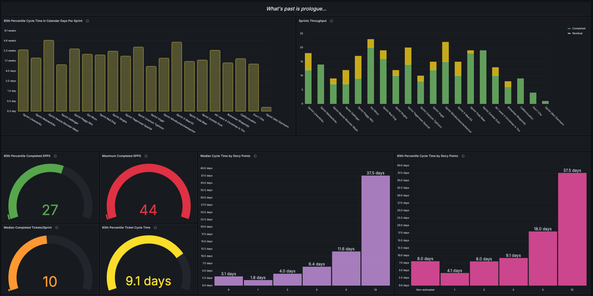
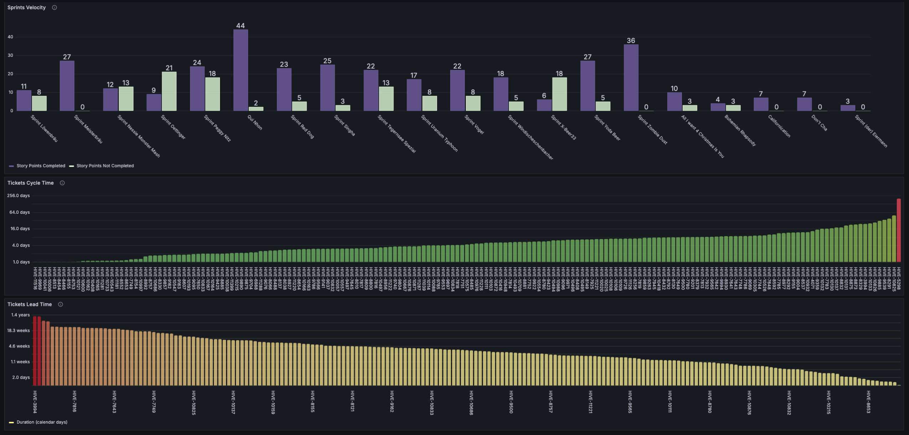

<h1 align="center"></h1>

    <b>Engineering and Management Metrics Platform for JSMD</b>

   
   
   
   

  
  
  
  

The **Streamline** project is about building a metrics platform that brings together data from Jira, GitLab, AWS,
Datadog, and other tools used across Jochen Schweizer mydays (JSMD). The goal is to give teams and managers clear,
data-driven insights into how work gets done, how fast code moves, how teams collaborate, how stable and costly systems
are, and how changes in process actually affect outcomes.

It’s not just about engineering metrics like delivery speed or reliability, it’s also about giving managers visibility
into team health, workload patterns, and the results of decisions over time. Instead of relying on gut feeling or
scattered reports, the platform helps everyone, developers, leads, and managers, make better calls based on real data.
In the end, it’s a tool to support smarter decisions, continuous improvement, and a more transparent way of working.

---

## How to run

1. Run `make init`
2. Add `JIRA_HOST` and `JIRA_TOKEN` to the **.env** file.
3. Edit the Jira section of the **settings.ini** file, with your preferences.
    - team: The name of the team.
    - project: The Jira project identifier
    - board_id: A numerical identifier for a specific board within the Jira instance.
    - sprint_start_at: The index of the first sprint to return (0 based).
    - issue_statuses: Type of Jira issues to consider.
4. Run `make build`
5. Run `make start`

## How to run fetch data

1. Run `bin/console database:synchronize`
2. It will take a few seconds, then the data will be populated in mongo DB.

## How to configure Grafana & Disaply the Charts

1. Login to Grafana using _admin/admin_.
2. Click _Skip_.
3. Click on **Connections** -> _Add new connection_.
4. Search for _"Infinity"_.
5. Click **Install** -> Click in the Infinity Icon.
6. Click on _Add New Datasource_
7. Write the name _"streamline-datasource"_
8. Go to **URL, Headers & Params** and in **Base Url** write _http://host.docker.internal:8000_
9. Click _Save & Test_
10. Click **Dashboards** -> **New** -> _Import_
11. Choose to upload the file _docker/grafana/dashboards/Engineering-metrics-X.X.json
12. Select **streamline-datasource** datasource.
13. You can now see the metrics dashboard.

## How to delete all the data

This applies to cases where you want to delete all data from the collections.

1. Run `bin/console database:clear`
2. All the collections are empty now.

## How to shudown

Run `make shutdown`

---

## Examples

---

## Workflow Metrics

Streamline supports Workflow Metrics, designed to help you understand and optimize how work flows through your
engineering teams. By tracking speed, throughput, and process bottlenecks, particularly in Scrum environments, these
tools answer critical questions about team performance. The insights reveal how work items like Jira tickets progress
from initial concept to final delivery, enabling continuous improvement and helping you measure the impact of process
changes over time.

### Sprint Cycle Time

Measures the average time it takes to complete a sprint, from the sprint’s start to its end date.

**Helps answer:**

- Are our sprints consistently timed and well-scoped?
- How does the duration of sprints impact delivery?

**Why it’s useful?** Identifies whether your sprint cadences are consistent and if your planning cycles align with
delivery capacity.

### Ticket Cycle Time

Measures the time a ticket takes from the moment it starts being worked on (e.g., moved to “In Progress”) to when it’s
completed (e.g., moved to “Done”).

**Helps answer:**

- How long does it take us to complete work once we start?
- Are there bottlenecks during the development or QA stages?

**Why it’s useful?** Helps assess execution efficiency and spot delays in active development.

### Ticket Lead Time

Measures the total time from when a ticket is created (first entered the backlog) to when it is completed.

**Helps answer:**

- How long do customers/stakeholders wait for a feature or fix?
- Is our backlog manageable or bloated?

**Why it’s useful?** Reflects the overall responsiveness of the team and the efficiency of the planning to delivery
pipeline.

### Throughput

The total number of completed tickets in a given time frame (e.g., per sprint or per week).

**Helps answer:**

- How much are we actually delivering?
- Are we delivering at a consistent pace?

**Why it’s useful?** Useful for measuring team output and identifying trends over time (e.g., delivery dips,
improvements, team changes).

### Velocity

The sum of story points completed in a sprint. Only considers completed (done) tickets.

**Helps answer:**

- How predictable is our delivery?
- Can we plan better for the next sprint?

**Why it’s useful?** Enables sprint planning and forecasting by helping teams understand their capacity and delivery
trends.

---

## Additional Information

### Notes

**Time Zone Awareness**

All datetime calculations assume that the time zone information is consistent and correct. If your data contains mixed
or missing time zones, results may be inaccurate.

**Partial Day Handling**

If a ticket is started or resolved partway through a workday, only the portion of the day that overlaps with working
hours is counted.

**Custom Calendar Required for Accurate Holidays**

If you want holidays to be excluded from working days, you must provide a custom calendar implementation. The default
logic (as seen in tests) only counts days explicitly marked as working.

**Spillover Tickets**

Tickets started before the sprint (outside the 6-hour offset) are not included in that sprint's metrics, even if
resolved during the sprint. This may affect teams that frequently carry over work between sprints.

### Caveats

**Working Days and Calendar Customization**

The calculation of cycle time and lead time is based on _working days_ not calendar days. The definition of a working
day is determined by a WorkCalendarProtocol implementation, which can be customized. If your calendar does not include
weekends or holidays as working days, those days are excluded from metrics.

**Workday Start/End and Partial Days**

Only the hours between the configured workday start and end times are counted. Time outside these hours is ignored, even
if a ticket is started or resolved during those times.
If a ticket is started or resolved outside working hours, only the overlapping portion with the workday is counted for
that day.

**Sprint Inclusion Logic**
A ticket is included in a sprint's metrics if its started_at is after the sprint's start (with a 6-hour offset before
the sprint start to account for early work). Tickets started before this window are excluded from that sprint's metrics,
even if resolved during the sprint.

**Throughput and Velocity Calculations**

Only tickets resolved before or at the sprint's close are counted as _completed_ for throughput and velocity. Tickets
resolved after the sprint ends are not included, even if they were started during the sprint.

**Story Points and Unestimated Tickets**

Metrics that rely on story points (like velocity) will be affected if tickets lack story point estimates. Unestimated
tickets may skew velocity and related metrics.

**No Handling of Ticket Re-openings or Multiple State Changes**

The system only considers the last time a ticket was set to _in progress_ and the last time it was set to _done_. If a
ticket is reopened or moved between states multiple times, only the final transitions are used for metrics. This may not
reflect the true time spent if tickets are frequently reopened.